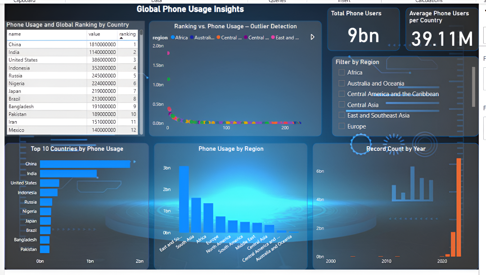

# 📱 Global Phone Usage Dashboard – Power BI Project

This Power BI dashboard presents a comprehensive analysis of **mobile phone usage across countries and regions**. It offers key insights into total users, usage distribution, rankings, and trends over time, helping uncover patterns, outliers, and potential areas of interest.

---

## 📊 Project Overview

This interactive dashboard provides:

- 📌 **Country-wise mobile phone usage**
- 🌍 **Region-wise distribution**
- 📈 **Trends over time**
- 🥇 **Global rankings based on usage**
- ❗ **Outlier detection using scatter plot analysis**

---

## 📁 Files Included

- `Phone Usage.pbix` → Main Power BI dashboard file
- `Phone Usage.csv` → Dataset used (global mobile usage)
- `phone usage dashboard.png` → Dashboard screenshot
- `README.md` → Project documentation (this file)

---

## 🔍 Key Insights from the Dashboard

- **Total Global Users**: Over **9 billion** recorded
- **Average per Country**: ~**39.11 million** users
- **Top 10 Countries**: China, India, and the US lead globally
- **Region-wise Usage**: East and Southeast Asia show the highest concentration
- **Outlier Detection**: Scatter plot highlights discrepancies between usage and ranking
- **Year-wise Record Count**: Shows consistency and data gaps over time

---

## 📌 Dashboard Features

| Feature                        | Description                                                  |
|-------------------------------|--------------------------------------------------------------|
| 💡 Phone Usage Table          | Country, value, and rank in one view                         |
| 📉 Ranking vs Usage Scatter   | Visual check for misaligned rankings or anomalies            |
| 📍 Regional Filter Slicer     | Dynamic filtering by region                                  |
| 🥇 Top 10 Chart               | Countries with the highest mobile usage                      |
| 🌎 Region-wise Bar Chart      | Aggregated phone usage by global region                      |
| 🕒 Year-wise Column Chart     | Record distribution by year for data quality check           |

---

## 🛠 Tools Used

- **Power BI**
- **Excel** (data cleaning)
- **DAX** (ranking, calculations)
- **Power Query** (for data transformation)

---

## 🚀 How to Use

1. Download the `.pbix` file
2. Open in Power BI Desktop
3. Explore filters (region) and interact with charts
4. Use this as a reference for analysis, learning, or showcasing skills

---

## 📌 Author

**Yasmeen Shah**  
💼 Aspiring Data/Business Analyst  
📍 Mumbai, India  
🌐 [LinkedIn (https://www.linkedin.com/in/yasmeen-shah-a4144025a)

---

## ⭐️ If you find this useful, feel free to star this repo or share it!
